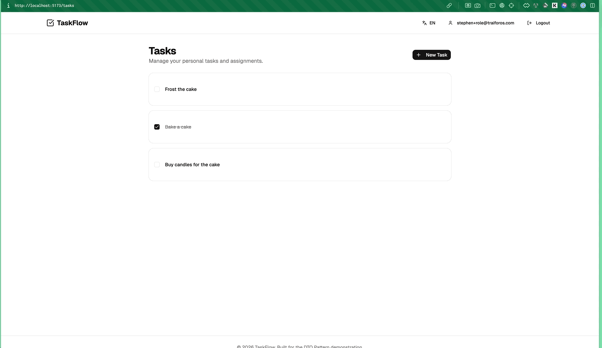
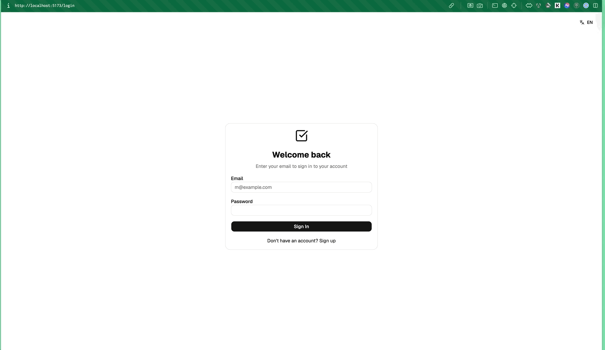
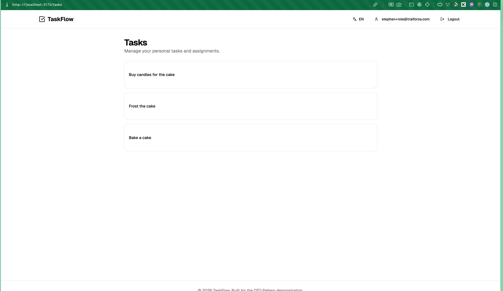
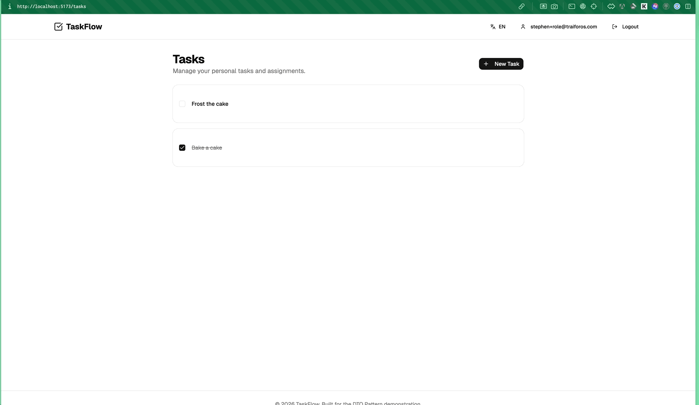

# Task Management App - Interview Take-Home

A Task Management application built with **.NET 10** and **React 19**. This project was developed as an interview take-home assignment to demonstrate advanced architectural patterns, bulletproof data isolation, and modern full-stack development practices.

---

## 🧠 My Thought Process & Architecture Decisions

When approaching this take-home assignment, my primary goal was to build a system that wasn't just functional, but **production-ready, secure by default, and highly maintainable**. Instead of taking shortcuts, I treated this as a foundation for a real-world enterprise application.

Here are the core pillars of my thought process (fully documented in the `docs/architecture/adrs/` directory):

### 1. Bulletproof Data Isolation (ADR 0011)
Data leaks are one of the most critical vulnerabilities in multi-tenant or multi-user SaaS applications. Instead of relying solely on application-level `Where(x => x.UserId == currentUserId)` clauses—which are easily forgotten—I implemented **PostgreSQL Row Level Security (RLS)**. 
* **The Result:** Data isolation is enforced at the database engine level via EF Core Interceptors. Even if a developer makes a mistake in the API, the database will outright reject queries that don't match the session's `app.current_user_id` or `app.user_role`.

### 2. Predictable, Layout-Shift-Free Frontend (ADR 0022 & 0004)
Modern React applications often suffer from "spinner hell" and layout shifts caused by component-level data fetching (`useEffect`). 
* **The Solution:** I utilized the **React Router v6 Data API** (`loader` and `action`) combined with **RxJS Singleton Services**. Data fetching and permission guards happen *before* the route renders. Components simply subscribe to Observable streams, resulting in a reactive, decoupled, and snappy UI.

### 3. Strict Separation of Concerns (ADR 0003 & 0017)
I wanted to ensure the API surface area was deliberate and secure.
* **The Solution:** Internal EF Core entities are **never** exposed. I implemented a strict DTO architecture (e.g., `TaskSummaryDto` for lists, `TaskDto` for details, `CreateTaskDto` for mutations) mapped via AutoMapper. To prevent boilerplate fatigue, I built a **Generic CRUD & SOA** layer (`ICrudRepository`, `ICrudService`), keeping controllers incredibly thin.

### 4. Build Once, Deploy Anywhere (ADR 0015 & 0024)
Following the **12-Factor App** methodology, I ensured the application is environment-agnostic.
* **The Solution:** The React frontend does not use build-time environment variables (`import.meta.env`). Instead, it fetches a `config.json` at runtime. This allows the exact same Docker image to be promoted from QA to Staging to Production without rebuilding.

### 5. Zero-Friction Developer Experience (ADR 0016)
Reviewing take-home assignments can be tedious if the reviewer has to install specific versions of SDKs or databases.
* **The Solution:** I containerized the entire development environment using **VS Code Dev Containers**. Opening the project automatically provisions the correct .NET SDK, Node.js version, and a PostgreSQL instance, applying migrations automatically.

---

## 🚀 Setup Steps (Zero-Setup Environment)

To make reviewing this project as easy as possible, I have configured a **VS Code Dev Container**. **You do not need to install .NET, Node.js, or PostgreSQL on your local machine.**

### Prerequisites
- [Visual Studio Code](https://code.visualstudio.com/)
- [Docker Desktop](https://www.docker.com/products/docker-desktop/) (running)
- [Dev Containers Extension](https://marketplace.visualstudio.com/items?itemName=ms-vscode-remote.remote-containers) for VS Code

### 1. Launch the Environment
1. Clone this repository to your local machine.
2. Open the cloned folder in **VS Code**.
3. A prompt will appear in the bottom right: **"Folder contains a Dev Container configuration file. Reopen folder to develop in a container."** Click **Reopen in Container**.
   * *(If you don't see the prompt, press `Cmd+Shift+P` (Mac) or `Ctrl+Shift+P` (Windows), type `Dev Containers: Reopen in Container`, and hit Enter).*
4. Grab a coffee ☕. Docker will build the environment, spin up PostgreSQL, install all dependencies, and apply database migrations automatically.

### 2. Access the Application (Inside Dev Container)
Once the container is built, the backend API and frontend client will start automatically in the background.

**Important:** To access the application, use the **"Ports"** tab in the VS Code panel (next to Terminal/Console) and click the globe icon next to port `5173` to open the UI in your browser. You can also access the API on port `5000`.

---

## 💻 Bare Metal / Local Setup (Alternative)

If you prefer to run the application on "bare metal" (directly on your host OS) without Docker/Dev Containers, you will need:
- .NET 10 SDK
- Node.js 24+
- PostgreSQL 18

### 1. Run the Backend API
Open a terminal and run:
```bash
cd TaskManagement.Api
dotnet run
```
* **API:** `http://localhost:5000`
* **Interactive API Docs (Scalar):** `http://localhost:5000/scalar/v1`

### 2. Run the Frontend Client
Open a *second* terminal and run:
```bash
cd TaskManagement.Client
npm run dev
```
* **App:** `http://localhost:5173`

*(Note: You can create test credentials via the Register page, or use the built-in Demo Role Swapper on the Profile page after registering to test RBAC).*

---

## 📸 Application Preview

Here are some quick demonstrations of the application's core features:

### Role-Based Access Control (Admin; Delete Permissions)


### Login & ReadOnly Role (View Only Permissions)


### User Role Update View (Edit Permissions)


### Internationalization (i18n)


---

## 📚 Documentation & API Testing

- **Architecture Decision Records (ADRs)**: A complete history of technical decisions is documented using VitePress. You can view the docs locally by running:
  ```bash
  cd docs
  npm install
  npm run docs:dev
  ```
- **API Testing**: A **Bruno** collection is provided in the `/bruno` directory, featuring pre-configured environments and automatic JWT token injection for seamless API exploration.

## 📝 Assumptions & Trade-offs
- **Local Storage for JWT**: For this MVP demonstration, the JWT is stored in `localStorage`. In a strict production environment, `HttpOnly` cookies would be implemented to mitigate XSS risks.
- **Auto-Migrations**: The API auto-migrates the database on startup to ensure a seamless reviewer experience. In a real-world scenario, migrations would be applied via a CI/CD pipeline.
